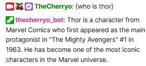

# 🧠 CherryBott — Twitch x LLM Smite Bot

**CherryBott** is a Twitch chatbot featuring interactive trivia games and external API chat integration. Originally designed with local LLM support via Ollama, it now focuses on database-driven trivia and external chat API responses for Smite2 and general knowledge questions.


---

## 🚀 Features

- 💬 Chat-based Q&A directly in Twitch with external API integration
- 🎲 **Database-driven trivia system** with organized categories and leaderboards
- 🕹️ **Smite2 trivia** - 256+ questions about god abilities
- 📊 **Multiple question types**: Multiple choice, True/False, Open-ended
- 🏆 **User statistics & leaderboards** with automatic tracking
- 🔗 **External chat API integration** for AI-powered responses
- 🗂️ **Organized data architecture** with focused, maintainable modules

---

## 🧰 Requirements

- Python 3.9+
- PostgreSQL database (via Docker)
- Twitch account and [OAuth token](https://twitchapps.com/tmi/)
- Optional: External chat API endpoint (see `!ask` and `!chat` commands)

---

## 🚀 Quick Start (Automated Setup)

**🍒 New! Use the automated launcher for effortless setup:**

### Linux/macOS:
```bash
./start.sh
```

### Windows:
```batch
start.bat
```

### Direct Python:
```bash
python3 launcher.py
```

**That's it! The launcher handles everything automatically:**
- ✅ Environment setup
- ✅ Token generation  
- ✅ Database initialization
- ✅ Question loading
- ✅ Bot startup

See [LAUNCHER_GUIDE.md](LAUNCHER_GUIDE.md) for detailed launcher documentation.

---

## 🔧 Manual Setup (Advanced Users)

If you prefer manual control or the launcher doesn't work:

### 1. Clone the Repo

```bash
git clone https://github.com/mohaned-dewedar/my-twitch-bot
cd my-twitch-bot
```
### 2. Install uv (if not already installed)

```bash
curl -LsSf https://astral.sh/uv/install.sh | sh
```

### 3. Install Dependencies
```bash
# This will automatically create a virtual environment and install dependencies
uv sync
```

### 4. Start Database
```bash
# Start PostgreSQL database
docker compose up -d

# Run database migrations
uv run alembic upgrade head

# Load trivia questions into database
uv run python -m scripts.load_questions
```

### 5. Configure Twitch Credentials 
Create a .env file in the project root:

```bash
TWITCH_BOT_NAME=your_bot_username
TWITCH_OAUTH_TOKEN=oauth:xxxxxxxxxxxxxxxxxxxxxx
TWITCH_CHANNEL=your_channel_name
```

### 6. Get Twitch OAuth Token

**Option A: Use Twitch CLI (Recommended)**
```bash
# Install Twitch CLI: https://dev.twitch.tv/docs/cli/
twitch token -u --scopes "chat:read chat:edit user:write:chat"
```

**Option B: Manual Process**
1. Go to [https://dev.twitch.tv/](https://dev.twitch.tv/) and create a **Twitch Developer account**
2. Create a new **Application** (Choose **Confidential** type)
3. Use your Client ID and Secret to generate tokens

### 7. Run the Bot
```bash
uv run python chat_listener.py
```

### How it works:
**Trivia System:**
- `!trivia` - Start general knowledge questions
- `!trivia smite` - Start Smite god ability questions  
- `!trivia auto` - Start continuous trivia mode
- `!answer <your answer>` - Submit answers (supports letter shortcuts: a/b/c/d)
- `!giveup` - End current question and show answer

**AI Chat Integration:**
- `!ask <question>` - Send questions to external chat API
- `!chat <question>` - Alternative chat command

* Applies a system prompt like:

> "You are CherryBott. You answer general questions, specialize in Smite2, and keep responses short, fun, and engaging. Do not ask follow-up questions."

* Sends the response back to Twitch chat

## 🎲 Trivia Functionality in Chat

CherryBott supports interactive trivia games directly in Twitch chat! Users can play general trivia or Smite-specific trivia using simple commands:

### Commands
- `!trivia` — Start a general trivia question (multiple choice, easy difficulty)
- `!trivia smite` — Start a Smite gods trivia question
- `!answer <your answer>` — Submit your answer to the current trivia question
- `!giveup` — End the current trivia round and reveal the answer
- `!trivia-help` — Show help for trivia commands

### How Trivia Appears in Chat
- Questions are sent with all answer options, clearly formatted with emojis for readability (e.g., 🇦 Option1 🇧 Option2 ...)
- Smite trivia asks you to name the god for a given ability
- General trivia uses easy questions from OpenTDB or custom questions

Enjoy competing with your chat and see who knows the most!

---

## 🏗️ Architecture & Code Organization

CherryBott has been recently refactored for better maintainability and code organization:

### 📁 Data Layer Structure
```
data/
├── smite/                    # Smite-specific data handling
│   ├── smite_data_store.py  # God and ability data management
│   └── smite_trivia_engine.py # Smite trivia game logic
├── opentdb/                  # OpenTDB API integration  
│   ├── opentdb_client.py    # API client with rate limiting
│   └── question_queue.py    # Pre-loading question buffer
└── custom/                   # Custom question loading
    └── custom_trivia_loader.py # JSON file-based questions
```

### 🎯 Key Improvements
- **Single Responsibility**: Each module has one clear purpose
- **Comprehensive Documentation**: Detailed docstrings and comments
- **Better Testability**: Smaller, focused modules are easier to test
- **Reduced Complexity**: Eliminated large "god classes" 
- **Legacy Code Removal**: Cleaned up unused Ollama integration

### 🧪 WIP / Future Tooling

Planned features to enhance CherryBott's intelligence and usability:

#### 🔍 Tool Integration
- ✅ Google Search (real-time lookups)
- ✅ `tracker.gg` API for live player stats or rankings
- ✅ Smite wiki and patch notes loader (RAG KB)

#### 🧠 Memory
- 🕒 Short-term memory during a Twitch session
- 🧾 Long-term user-specific memory (basic vector DB)

#### 🔗 Model Abstraction
- 🌐 Use **more powerful models via HTTP APIs** (e.g., GPT, Mixtral, etc.)
- 🔄 Swap between Ollama models or remote endpoints dynamically

---

### 🛠️ TODO & Improvements

#### ✅ Recently Completed
- [x] **Code Architecture Refactoring** - Split monolithic data loader into focused modules
- [x] **Legacy Code Removal** - Cleaned up unused Ollama integration  
- [x] **Comprehensive Documentation** - Added detailed docstrings and comments
- [x] **Test Coverage** - Updated and validated all test suites

#### 🔄 Next Phase Priorities  
- [ ] **IRC Client Refactoring** - Split large IRC client into smaller, focused classes
- [ ] **Dependency Injection** - Replace singleton database pattern
- [ ] **Configuration Management** - Centralized config with validation
- [ ] **Error Handling** - Standardized error handling with custom exceptions

#### 🚀 Future Features
- [ ] `.txt` file or UI to change the system prompt without code edits  
- [ ] Configurable model swapping (via `.env` or CLI args)  
- [ ] Packaged `.exe` or launcher for non-technical users  
- [ ] Web dashboard to monitor or test prompts outside of Twitch  

I will most likely stop working on this for a bit to scrape and gather the needed information to make this viable for RAG and make it useful for my chat then come back to this.
